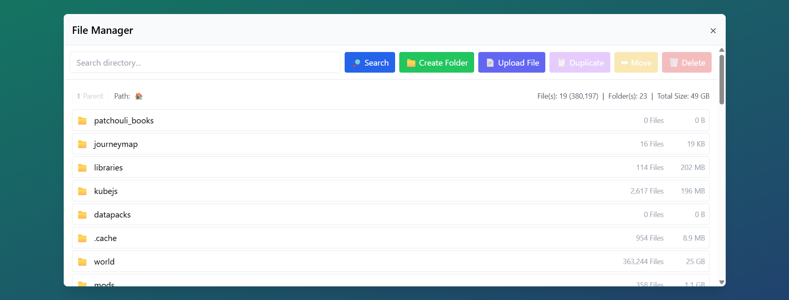

## File Manager



This **File Manager** was built using **asp.net (v8)** that serves static html content with a **pure JavaScript** frontend implementation for complex UI/UX actions.   The ASP.Net backend serves as an API, allowing for fetching to Create, Read, Update, and Delete items within a **configurable root directory**.

Currently visible via: http://147.135.8.138:8080/

## Features:

### Architectural Design Features:

&nbsp; &nbsp; :heavy_check_mark:  ASP.net v8 Backend

&nbsp; &nbsp; :heavy_check_mark:  Pure Javascript Frontend

&nbsp; &nbsp; :heavy_check_mark:  Tailwind CSS for consistent styling

&nbsp; &nbsp; :heavy_check_mark:  Single Page Application

&nbsp; &nbsp; :heavy_check_mark:  Deep Linkable URL Pattern

&nbsp; &nbsp; :heavy_check_mark:  Entire file mangager is within a modal

### Application Features:

&nbsp; &nbsp; :heavy_check_mark:  <u>Browse</u> Heirarchal Directory Structures

&nbsp; &nbsp; :heavy_check_mark:  <u>Search</u> directories for specific names

&nbsp; &nbsp; :heavy_check_mark:  <u>Create new folders</u> :open_file_folder: 

&nbsp; &nbsp; :heavy_check_mark:  <u>Upload new files</u> :page_with_curl: 

&nbsp; &nbsp; :heavy_check_mark:  <u>Move</u> both files :page_with_curl: and folders :open_file_folder:

&nbsp; &nbsp; :heavy_check_mark:  <u>Delete</u> both files :page_with_curl: and folders :open_file_folder:

&nbsp; &nbsp; :heavy_check_mark:  <u>Duplicate</u> both files :page_with_curl: and folders :open_file_folder:

&nbsp; &nbsp; :heavy_check_mark:  Perform <u>Bulk Actions</u> (Move, Copy, and Delete)

&nbsp; &nbsp; :heavy_check_mark:  Navigable <u>Breadcrumbs</u> for easy deep folder traversal

&nbsp; &nbsp; :heavy_check_mark:  View Directory <u>Statistics</u> (Overall Size & Total File Counts)

&nbsp; &nbsp; :heavy_check_mark: Performance:

&nbsp; &nbsp; &nbsp; &nbsp; &nbsp; &nbsp; :gem: Smart directory statistic caching

## Development

If you're interested in running the code yourself:

1. Clone the repository
1. Open Project in VSCode
1. Install Recommended Extensions
    - C#
    - C# Dev Kit
    - .NET Install Tool
1. Make sure you have .NET 8 SDK & Runtime installed
1. From the integrated terminal (`ctrl + ~`), run:
    ```bash    
    dotnet watch run
    ```

## Deployment

The application is built and bundled into a docker image that can be deployed nearly anywhere.  View the `./docker-compose.yml` file for sample deployment.

## Improvements

- Add drag and drop functionality for uploading of files.
- Include a deep search mechanic that would search nested folders for a text string
- Multi-file downloads
- DOM Performance: Do not list all files at once in the DOM.  Implement a virtual scroller that only renders the DOM elements that are actively on the screen and then reuses them as scrolling occurs.   This will be particularly useful when folders exceed hundreds of thousands items.
- Add More Loading indicators (currently only on file list loading)
- Keybinds

## AI Usage:

During this process I used VS Code Copilot (generalized prompts below) and Locally hosted models (Qwen3) for Inline Edit Suggestions.  And Gemini responses when googling various C#/.Net methodologies.  No longer have access to exact prompts, but they as follows:

  - "Using the .net codebase, in the ApiController stub out API methods for CRUD operations."
    - Being new to C# and .Net the exact syntax is something that I was not fluent in.   While I could have easily went to google to accomplish this, I felt the simple use of AI was adequete.   This was able to create the shell of the api with empty functions that accepted GET, POST, DELETE operations.

  - "Within .Net, how do I change routing so that all requests not mapped to an api endpoint fallback and render the frontend application."
    - This directed me to the `program.cs` and how the .Net routing works, this helped change the API to serve the JS code as a SPA.

  - I asked AI about improving the methodology of loading the files and folders within a directory.   It felt like extra unnecessary overhead to look for all folders within a directory and then go back and look at all files within a directory.   
    - Sadly within .Net this is the way that you need to do it.

  - When I got to the point of trying to improve the performance, I knew that I/O operations are always expensive and when trying to recusively do so within large numbers of subfolder, I knew this needed to be optimized.  I determined that caching the metrics would be a good first stab at performance as whenever you navigate down and up the folder tree you're doing those heavy operations over and over again.    So I asked AI:  "Extract my file caching logic out to a helper method and implement caching at each folder level via storaging in a map of sorts".
    - The first iteration of what AI generated, while it worked, was atrocious.  There was heavy duplication of code, poor logic implemented, added extra overhead for Normalizing the path every traversed file / folder.  While there were some fruitful outcomes, such as the use of a ConcurrentDictionary as its map.
  
  - Towards the end of the project, I prompted AI with: "Go through my project and find any dead code that could be removed, or locations that code id duplicated and can be simplified by extracting it out.   Do not make any changes yet, prompt your ideas and let me decide whether to take action or not."
    - This did find a few misc cleanup items and it even identified a bug that was in the code.

## Challenges:

Unfamiliarity with C#.   While i do have some experience in recent years with C/C++, I was plesantly surpised when C# is significantly more like Java than C/C++.   This allowed me to utilize previous knowledge of similar languages and jump in quickly.   Naming conventions are going to take a little bit to get used to (Capitalized Functions), but overall I was happy with the outcome and how much .Net bundles in that helps accelerate development.